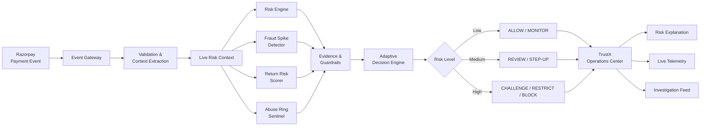
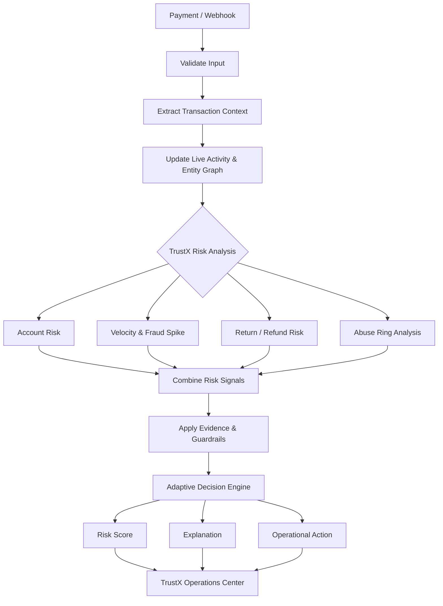

<div align="center">

# 🛡️ TrustX

### AI-Powered Transaction Risk Intelligence Platform

**Detect fraud. Uncover abuse. Understand risk. Act in real time.**

Track 02 — AI Risk Manager · Razorpay Buildathon 2026

<br>

[](https://trustx-frontend.onrender.com/)
[](https://trustx-backend.onrender.com/)

</div>

---

<div align="center">

| 🖥️ **Live TrustX Dashboard** | ⚡ **Live TrustX API** |
|:---:|:---:|
| Real-time risk monitoring and investigation | FastAPI backend powering TrustX |
| Risk Engine · Fraud Spikes · Abuse Rings | Risk Scoring · Webhooks · Live Telemetry |
| **[Open Dashboard →](https://trustx-frontend.onrender.com/)** | **[Open API →](https://trustx-backend.onrender.com/)** |

</div>

---
## 1. Overview

TrustX is an AI-powered transaction risk intelligence platform designed to
detect and investigate suspicious payment and merchant-abuse activity in real
time.

Unlike systems that evaluate transactions individually, TrustX combines
account behavior, transaction history, payment activity, temporal velocity,
device and IP relationships, payment instruments, addresses, and return/refund
patterns to build a broader view of risk.

### 2. Features

| Model | Purpose | What It Detects | Output |
|---|---|---|---|
| **Risk Engine** | Account-level risk assessment and transaction decisioning | Suspicious account behavior, abnormal spending, return/refund patterns, account and device activity | Risk score (0–100), risk tier, and decision such as `ALLOW`, `MANUAL_REVIEW`, or `CHALLENGE_OR_BLOCK` |
| **Fraud Spike Detector** | Real-time temporal fraud and velocity monitoring | Sudden transaction surges, abnormal fraud-rate changes, short-term payment bursts, and automated activity | Spike probability, anomaly score, spike flag, persistence status, and traffic classification |
| **Return Risk Scorer** | Post-purchase return and refund risk assessment | Excessive returns, repeated refund claims, high-value return patterns, and suspicious return behavior | Return risk score (0–100), risk tier, and fulfillment action |
| **Abuse Ring Sentinel** | Coordinated multi-account risk detection | Accounts connected through shared devices, IP addresses, payment methods, or addresses | Ring probability, operational verdict, and account attribution such as `CORE_MEMBER`, `PERIPHERAL_MEMBER`, or `INCIDENTAL_BYSTANDER` |

### How the Models Work Together

TrustX does not rely on a single model to make a risk decision.

Each model focuses on a different type of abuse:

**Account Risk → Transaction Velocity → Return Behavior → Entity Relationships**

The resulting signals are combined with deterministic evidence and policy
guardrails before TrustX produces an operational recommendation.

This allows TrustX to move beyond simply asking **"Is this transaction risky?"**
and instead answer **"Why is it risky, what is happening around it, and what
should we do next?"**
---
## 3. Architecture

TrustX follows a multi-layer architecture that connects payment events, live risk signals, specialized ML models, and policy-based decisioning.


---
### 4. System Flow



### Architecture Components

| Component | Responsibility |
|---|---|
| **Event Gateway** | Receives Razorpay webhook and API events. |
| **Live Risk Context** | Maintains transaction, account, device, IP, address, payment, and velocity signals. |
| **Risk Intelligence Layer** | Runs the four specialized TrustX risk models. |
| **Evidence & Guardrails** | Combines model outputs with deterministic evidence and protection rules. |
| **Adaptive Decision Engine** | Converts the combined risk signals into an operational action. |
| **Operations Center** | Presents risk scores, explanations, telemetry, and investigation results. |
---

## 5. Machine Learning Models

TrustX maintains four specialized machine learning models serialized in the `models/` directory. Each model addresses a specific operational risk domain:

| Model File | Model Architecture | Purpose | Input Features | Output | Training Script |
| :--- | :--- | :--- | :--- | :--- | :--- |
| `risk_engine_rf.joblib` | Scikit-Learn Pipeline (`ColumnTransformer` + `RandomForestClassifier`) | Account-level behavioral risk and general merchant abuse scoring | 15 features: 13 numeric (orders, returns, refunds, spend, AOV, account age, devices, IPs, cards, return rate, refund rate, high-value count, suspicious score) + 2 categorical (`device_type`, `primary_payment_method`) | Continuous probability $[0.0, 1.0]$, calibrated risk score (0-100), qualitative tier (`LOW`, `MEDIUM`, `HIGH`) | `src/train.py` |
| `fraud_spike_model.joblib` | `RandomForestClassifier` (100 estimators, balanced class weights) | Temporal fraud surge and velocity burst detection | 15 temporal features: baseline vs. current transaction counts, fraud counts, fraud rates, deltas, ratios, volume surge ratio, device concentration ratio, suspicious score deltas | Spike probability $[0.0, 1.0]$, binary spike prediction flag, feature importances | `src/train_fraud_spike.py` |
| `return_risk_model.joblib` | Scikit-Learn Pipeline (`ColumnTransformer` + `RandomForestClassifier`) | Dedicated detection of serial return abuse and wardrobing | 15 retail features: return rate, refund rate, return count, refund count, high-value orders, total spend, AOV, account age, device/IP counts, categoricals | Return abuse probability $[0.0, 1.0]$, return risk score (0-100), return tier (`LOW`, `MEDIUM`, `HIGH`) | `src/train_return_risk.py` |
| `abuse_ring_model.joblib` | `CalibratedClassifierCV` wrapping `RandomForestClassifier` (5-fold cross-validation) | Coordinated syndicate and multi-accounting detection on graph clusters | 15 graph features: account count, device count, IP count, card count, address count, total entities, total edges, sharing ratios, edge density, max component size, mean/max suspicious scores | Calibrated ring probability $[0.0, 1.0]$, cluster prediction flag | `src/train_abuse_ring.py` |

---

## 6. Machine Learning Pipeline

The machine learning lifecycle in TrustX follows a strict, reproducible sequence from data generation to runtime inference:

```text
Data Synthesis & Partitions
(Reproducible seed=42)
           |
           v
Preprocessing & Feature Engineering
(ColumnTransformer: Median Imputation + OneHotEncoder)
           |
           v
Model Training & Calibration
(RandomForestClassifier + CalibratedClassifierCV)
           |
           v
Held-Out Test Partition Evaluation
(Precision, Recall, F1, ROC-AUC, Confusion Matrix)
           |
           v
Artifact Serialization
(Serialized via joblib with JSON metadata)
           |
           v
Runtime Pre-Loading & Inference
(FastAPI lifespan pre-loads all models at startup)
```
---

## 7. Risk Scoring and Decisioning

### Risk Score Calculation
Account risk scores map raw model probabilities to an intuitive 0 to 100 integer scale:

$$\text{Risk Score} = \text{round}(P(\text{abuse} = 1) \times 100)$$

### Qualitative Severity Tiers
Scores are classified into standardized operational risk tiers defined in `src/features.py`:
- **LOW** (Score 0 to 29): Standard legitimate customer behavior. Permitted with baseline monitoring.
- **MEDIUM** (Score 30 to 69): Borderline or elevated risk indicators. Held for secondary review or challenged with two-factor authentication.
- **HIGH** (Score 70 to 100): High-confidence abuse indicators. Subject to transactional restriction or outright decline.

### Adaptive Decision Policies
The `AdaptiveDecisionEngine` in `src/decision_engine.py` evaluates feature rules downstream of model inference to produce specific directives:

```text
Score & Feature Evaluation
           |
           +---> Return Rate > 50% & Orders >= 3           --> SERIAL_RETURN_ABUSE
           |
           +---> Devices >= 3, IPs >= 4, Cards >= 3         --> COORDINATED_SYNDICATE
           |
           +---> Account Age <= 14 days & Burst >= 3       --> BOT_OR_AUTOMATION
           |
           +---> Spend >= $1500 & AOV >= $120              --> HIGH_VALUE_RISK
           |
           +---> Score >= 70                               --> GENERAL_HIGH_RISK
           |
           +---> Score 30-69                               --> MEDIUM_RISK_REVIEW
           |
           +---> Score < 30                                --> LOW_RISK_STANDARD
```

- **Action Directives**:
  - Checkout Domain: `ALLOW`, `MANUAL_REVIEW`, `CHALLENGE_OR_BLOCK`.
  - Return Domain: `ALLOW_STANDARD_RETURNS`, `FLAG_FOR_RETURN_DESK_AUDIT`, `RESTRICT_INSTANT_REFUNDS_AND_INSPECT`.
  - Abuse Ring Domain: `NO_ACTION`, `MONITOR`, `REVIEW_CLUSTER`, `REVIEW_ACCOUNTS`, `RESTRICT_SELECTED_ACCOUNT`, `BLOCK_ENTIRE_RING`.

---

## 8. API and Webhook Integration

TrustX provides a comprehensive REST API implemented with FastAPI, including native support for Razorpay Test Mode webhook ingestion.

### Key API Endpoints

| Method | Endpoint | Description |
| :--- | :--- | :--- |
| `GET` | `/health` | System health check and model loading verification |
| `GET` | `/risk/account/{account_id}` | Retrieve account profile and historical metrics |
| `GET` | `/risk/account/{account_id}/live` | Retrieve isolated live activity derived from webhooks |
| `GET` | `/risk/accounts/samples` | List sample account identifiers for investigation |
| `POST` | `/risk/score` | Score account risk and receive adaptive policy recommendations |
| `POST` | `/risk/fraud-spike` | Evaluate merchant fraud spike metrics |
| `GET` | `/risk/fraud-spike/live` | Retrieve live rolling 5m and 1h telemetry metrics |
| `POST` | `/risk/fraud-spike/live/evaluate` | Run fraud spike detection over current live telemetry |
| `POST` | `/risk/abuse-ring` | Evaluate candidate cluster for abuse-ring detection |
| `GET` | `/risk/abuse-ring/live` | Retrieve current Live Abuse Graph state and clusters |
| `GET` | `/risk/abuse-ring/live/{account_id}` | Retrieve live graph neighborhood for a specific account |
| `POST` | `/risk/abuse-ring/live/analyze` | Evaluate live graph cluster with Abuse Ring Sentinel |
| `POST` | `/risk/abuse-ring/live/simulate` | Run deterministic live attack simulation scenarios |
| `POST` | `/payments/create-order` | Create payment order and capture genuine client IP and address |
| `POST` | `/webhooks/razorpay` | Ingest and verify real-time Razorpay Test Mode webhooks |
| `GET` | `/webhooks/razorpay/status` | Operational status of Razorpay webhook adapter |
| `GET` | `/webhooks/razorpay/events` | Stream recent risk events derived from webhooks |

### 8.a Razorpay Webhook Setup

### 1. Enable Test Mode

In Razorpay Dashboard, switch to **Test Mode**.

Go to:

**Account & Settings → Webhooks → Add New Webhook**

### 2. Add TrustX Webhook

| Setting | Value |
|---|---|
| Webhook URL | `https://trustx-backend.onrender.com/webhooks/razorpay` |
| Secret | Your own webhook secret |
| Mode | Test Mode |

Enable these events:

- `payment.authorized`
- `payment.captured`
- `payment.failed`

### 3. Add Environment Variables

```env
RAZORPAY_KEY_ID=rzp_test_...
RAZORPAY_KEY_SECRET=...
RAZORPAY_WEBHOOK_SECRET=your_webhook_secret
```

---

## 9. Technology Stack

| Layer | Technology | Version / Specification | Purpose |
| :--- | :--- | :--- | :--- |
| **Frontend Framework** | React | 18.3.1 | Component-based interactive user interface |
| **Language (Frontend)** | TypeScript | 5.5.3 | Static type safety and structured API contract validation |
| **Build Tool** | Vite | 5.4.2 | Development server and optimized ES module bundling |
| **Styling** | Vanilla CSS | Custom Design System | High-performance dark-theme design tokens without framework overhead |
| **Icons** | Lucide React | 0.441.0 | Operational UI iconography |
| **Routing** | React Router DOM | 6.26.0 | Client-side routing across operational views |
| **Backend Framework** | FastAPI | >= 0.100.0 | High-performance asynchronous REST API framework |
| **ASGI Server** | Uvicorn | >= 0.23.0 | Production ASGI application server |
| **Data Validation** | Pydantic | >= 2.0.0 | Strict request/response schema modeling and serialization |
| **Machine Learning** | Scikit-Learn | >= 1.3.0 | Random Forest classification, calibration, and preprocessing |
| **Data Processing** | NumPy / Pandas | >= 1.24.0 / >= 2.0.0 | Vectorized numerical operations and tabular transformations |
| **Model Serialization** | Joblib | >= 1.3.0 | Serialization and deserialization of fitted pipeline bundles |
| **HTTP Client** | HTTPX | >= 0.24.0 | Asynchronous HTTP requests and API integration testing |
| **Testing Framework** | Pytest | >= 7.4.0 | Unit, integration, and regression test execution |

---

## 10. Project Structure

```text
TrustX-Razorpay-Buildathon/
├── data/                                      # Datasets and synthetic evaluation partitions
│   ├── fraud_spike_dataset.csv               # Historical fraud spike dataset
│   ├── return_risk_accounts.csv              # Return abuse dataset
│   ├── ring_accounts.csv                     # Graph network account records
│   ├── ring_entity_edges.csv                 # Bipartite entity interaction edges
│   ├── synthetic_accounts.csv                # Primary account risk dataset
│   ├── train.csv                             # Account risk training partition (80%)
│   └── test.csv                              # Account risk held-out test partition (20%)
├── frontend/                                  # React 18 + Vite dashboard
│   ├── public/                               # Static assets
│   ├── src/
│   │   ├── components/                       # Modular UI cards, headers, and panels
│   │   │   ├── abuse-ring/                   # Graph exploration components
│   │   │   ├── account-risk/                 # Profile and explainability components
│   │   │   ├── fraud-spike/                  # Velocity radar components
│   │   │   ├── operations/                   # Investigation drawer and feed items
│   │   │   ├── Header.tsx                    # Top system status and connection badge
│   │   │   └── Sidebar.tsx                   # Brand navigation and engine status
│   │   ├── context/                          # RiskFeedContext for in-memory event streaming
│   │   ├── layouts/                          # AppLayout wrapper
│   │   ├── pages/                            # Overview, RiskOps, Account, Spike, Ring, Simulator
│   │   ├── services/                         # Typed API client (api.ts)
│   │   ├── types/                            # TypeScript interfaces for API schemas
│   │   ├── index.css                         # CSS design tokens and layout styling
│   │   └── main.tsx                          # Application entry point
│   ├── index.html                            # Root HTML template
│   ├── package.json                          # Frontend dependencies and scripts
│   ├── tsconfig.json                         # TypeScript configuration
│   └── vite.config.ts                        # Vite bundler configuration
├── models/                                    # Serialized machine learning models and metadata
│   ├── abuse_ring_model.joblib               # Calibrated Random Forest for abuse rings
│   ├── fraud_spike_model.joblib              # Random Forest for temporal fraud spikes
│   ├── return_risk_model.joblib              # Random Forest for return & refund abuse
│   ├── risk_engine_rf.joblib                 # Unified Pipeline for account risk scoring
│   ├── fraud_spike_metadata.json             # Fraud spike hyperparameters and metrics
│   ├── model_metadata.json                   # Risk engine hyperparameters and metrics
│   └── return_risk_metadata.json             # Return risk hyperparameters and metrics
├── src/                                       # Core Python risk engine implementation
│   ├── __init__.py
│   ├── abuse_ring_data_generator.py          # Synthetic syndicate and benign cluster generator
│   ├── abuse_ring_features.py                # 15-feature bipartite cluster feature extraction
│   ├── abuse_ring_sentinel.py                # Abuse Ring Sentinel inference and attribution
│   ├── account_store.py                      # Thread-safe indexed account profile store
│   ├── api.py                                # FastAPI REST service and route definitions
│   ├── data_generator.py                     # Synthetic account behavioral data generator
│   ├── decision_engine.py                    # Adaptive decision policies and action logic
│   ├── evaluate.py                           # Precision, recall, and evaluation metrics
│   ├── explainer.py                          # Dual-layer natural-language explainability
│   ├── features.py                           # Input schema, validation, clamping, and quality
│   ├── fraud_spike_detector.py               # Temporal surge detector with P1/P3/P5 guardrails
│   ├── live_abuse_graph.py                   # Thread-safe in-memory bipartite entity graph store
│   ├── live_activity.py                      # Thread-safe account live activity tracking
│   ├── live_fraud_telemetry.py               # Thread-safe rolling 5m/1h telemetry store
│   ├── live_simulation.py                    # Deterministic live attack scenario injector
│   ├── model_pipeline.py                     # Unified Scikit-Learn pipeline builder
│   ├── payment_context.py                    # Client IP capture and address hashing store
│   ├── razorpay_webhook.py                   # HMAC verification, idempotency, and ingestion
│   ├── return_risk_scorer.py                 # Dedicated return & refund abuse scorer
│   ├── risk_scorer.py                        # Account risk inference and scoring engine
│   ├── temporal_data_generator.py            # Rolling window temporal dataset generator
│   ├── train.py                              # Account risk model training script
│   ├── train_abuse_ring.py                   # Abuse ring model training and calibration script
│   ├── train_fraud_spike.py                  # Fraud spike model training script
│   └── train_return_risk.py                  # Return risk model training script
├── tests/                                     # Automated test suite (Pytest)
│   ├── test_abuse_ring_api.py                # Abuse ring REST API tests
│   ├── test_abuse_ring_sentinel.py           # Sentinel inference and attribution tests
│   ├── test_account_live_activity.py         # Live activity webhook correlation tests
│   ├── test_api.py                           # FastAPI endpoint regression tests
│   ├── test_data_generator.py                # Dataset schema and reproducibility tests
│   ├── test_decision_engine.py               # Adaptive policy decision logic tests
│   ├── test_fraud_spike.py                   # Fraud spike detector and guardrail tests
│   ├── test_live_abuse_address_capture.py    # Address capture and SHA-256 hashing tests
│   ├── test_live_abuse_graph.py              # Bipartite graph store and clustering tests
│   ├── test_live_abuse_ip_capture.py         # Client IP extraction and validation tests
│   ├── test_live_abuse_ring_attack_simulation.py # Live attack simulation tests
│   ├── test_live_fraud_telemetry.py          # Rolling 5m/1h telemetry store tests
│   ├── test_razorpay_webhook.py              # HMAC signature and idempotency tests
│   ├── test_return_risk.py                   # Return risk scorer and policy tests
│   └── test_risk_scorer.py                   # Model inference, edge cases, and quality tests
├── .env.example                               # Example environment variable template
├── .gitignore                                 # Git ignore configuration
├── requirements.txt                           # Python dependencies
├── run_pipeline.py                            # End-to-end training and inference execution script
└── README.md                                  # Project documentation
```

---

## 11. Getting Started

### Prerequisites

- Python 3.10 or higher
- Node.js 18 or higher and npm

### 11.a Backend Setup

1. Create and activate a virtual environment:

   ```bash
   python -m venv venv
   ```

   **Windows:**
   ```bash
   .\venv\Scripts\activate
   ```

   **macOS/Linux:**
   ```bash
   source venv/bin/activate
   ```

2. Install dependencies:

   ```bash
   pip install -r requirements.txt
   ```

3. Configure environment variables:

   ```bash
   cp .env.example .env
   ```

4. Start the FastAPI backend:

   ```bash
   uvicorn src.api:app --host 127.0.0.1 --port 8000 --reload
   ```

   API documentation: `http://127.0.0.1:8000/docs`

   The Razorpay webhook endpoint is available at:
   `POST /webhooks/razorpay`

### 11.b Frontend Setup

1. Install frontend dependencies:

   ```bash
   cd frontend
   npm install
   ```

2. Start the development server:

   ```bash
   npm run dev
   ```

   Open `http://localhost:5173` in your browser.

3. Build for production:

   ```bash
   npm run build
   ```

### 11.c Razorpay Webhook Testing

For the deployed TrustX backend, no separate webhook command is required. Razorpay sends events directly to:

`https://trustx-backend.onrender.com/webhooks/razorpay`

For local testing, the FastAPI server must remain running and the local webhook endpoint must be exposed through a public HTTPS tunnel.

### Running Tests

```bash
pytest tests -v
```
---

## 12. Future Enhancements

1. **Automatic Blocking of High-Risk Accounts**  
   Automatically block or temporarily restrict accounts when TrustX detects extremely suspicious activity, instead of only flagging them for review.

2. **Real-Time Event Streaming**  
   Add Kafka or a similar event-streaming system so TrustX can process large volumes of payment activity continuously and in real time.

3. **Smarter Abuse Ring Detection**  
   Improve the Abuse Ring Sentinel to discover larger and more complex fraud networks as new accounts, devices, IPs, and payment methods appear.

4. **Continuous Model Learning**  
   Periodically retrain the risk models using new transaction patterns so TrustX can adapt to changing fraud and abuse behaviour.

5. **Investigation Case Management**  
   Allow risk teams to create cases from suspicious activity, assign them to analysts, add investigation notes, and record the final decision.

7. **Production-Scale Infrastructure**  
   Improve scalability, monitoring, caching, and fault tolerance so TrustX can reliably handle much larger transaction volumes.

---

## 13. Author

### Thejasvini Gangaiah

AI/ML & Software Developer

Built **TrustX** for the **Razorpay Buildathon 2026 — Track 02: AI Risk Manager**.

---

