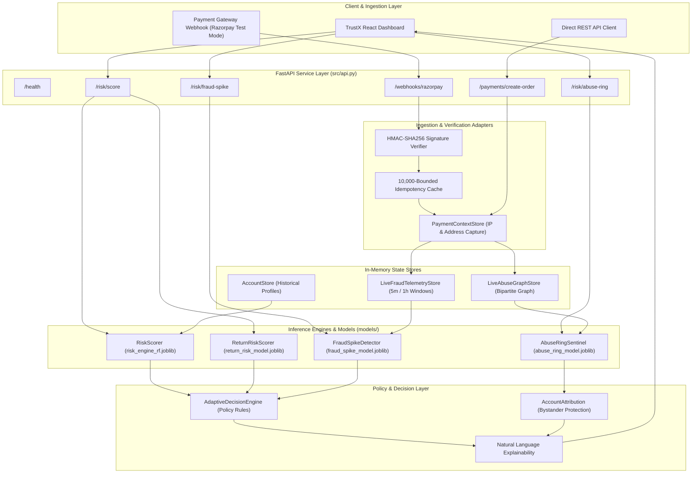

<div align="center">

# 🛡️ TrustX

### AI-Powered Transaction Risk Intelligence Platform

**Detect fraud. Uncover abuse. Understand risk. Act in real time.**

Track 02 — AI Risk Manager · Razorpay Buildathon 2026

<br>

[](https://trustx-frontend.onrender.com/)
[](https://trustx-backend.onrender.com/)

</div>

---

<div align="center">

| 🖥️ **Live TrustX Dashboard** | ⚡ **Live TrustX API** |
|:---:|:---:|
| Real-time risk monitoring and investigation | FastAPI backend powering TrustX |
| Risk Engine · Fraud Spikes · Abuse Rings | Risk Scoring · Webhooks · Live Telemetry |
| **[Open Dashboard →](https://trustx-frontend.onrender.com/)** | **[Open API →](https://trustx-backend.onrender.com/)** |

</div>

---

## 🛡️ What is TrustX?

TrustX is an AI-powered transaction risk intelligence platform built to help
merchants detect suspicious payment activity and coordinated abuse in real time.

It combines **machine learning, behavioral analysis, temporal signals, and entity
relationships** to identify risks that traditional transaction-by-transaction
fraud detection can miss.

TrustX brings multiple risk signals together into one operational platform,
helping teams move from **“something looks suspicious”** to **“here's why it's
risky and what we should do next.”**

---

## 2. Problem

Traditional fraud detection systems typically evaluate transactions in isolation. An isolated rule or score checks whether an individual transaction exceeds a dollar limit or originates from an unrecognized location. While useful, this approach fails to capture complex, coordinated, or time-distributed abuse patterns:

- **Isolated vs. Coordinated Attacks**: Fraud syndicates distribute activity across dozens of newly created or compromised accounts. When viewed individually, each account may appear low-risk. However, when analyzed in aggregate, these accounts share devices, IP subnets, or delivery destinations.
- **Velocity and Surge Anomaly Blindness**: Rapid card testing or automated bot attacks can flood a payment gateway within minutes. Static hourly thresholds often trigger too late, missing short-duration micro-bursts that degrade authorization rates and increase merchant fees.
- **Serial Return and Wardrobing Abuse**: Legitimate customer returns are a normal part of e-commerce. Fraudulent return abuse occurs when bad actors exploit lenient return policies by purchasing high-value items, claiming refunds, and returning counterfeit or empty packages. Treating all returns as fraud harms customer trust, while ignoring excessive return velocity leads to significant inventory loss.
- **False Positive Overhead and Bystander Harm**: Overly aggressive graph clustering or IP-based blocking often penalizes legitimate users who happen to share public Wi-Fi networks, corporate proxies, or household devices. A robust defense system must distinguish genuine collusive networks from incidental benign sharing.

---

## 3. Solution

TrustX implements a multi-layered defense architecture that evaluates risk at the transaction, account, temporal, and network levels. Data flows through a unified pipeline from event ingestion to analyst decisioning:

```text
Payment / Webhook Event
           |
           v
Input Validation & Sanitization
           |
           v
Feature Extraction & Entity Graph Correlation
           |
           +---------------------------------------------+
           |                                             |
           v                                             v
Machine Learning Inference                    Deterministic Evidence & Guardrails
(Random Forest Pipelines)                    (P1 Bursts, P3 Persistence, Bystander Protection)
           |                                             |
           +---------------------------------------------+
                                   |
                                   v
                      Adaptive Decision Engine
                                   |
                                   v
             Calibrated Risk Score & Action Directives
             (ALLOW, MANUAL_REVIEW, CHALLENGE_OR_BLOCK)
                                   |
                                   v
                        TrustX Operations Center
```

Key characteristics of this solution include:
- **Zero Fabrication**: All telemetry, entity relationships, and evaluation scores derive strictly from verified event inputs and immutable store records.
- **Multi-Engine Synthesis**: General account risk, temporal velocity surges, return abuse, and graph-level syndicates are evaluated by dedicated engines with domain-specific feature representations.
- **Bystander Protection**: Network clustering applies deterministic discounting when connections occur over shared public infrastructure, preventing false-positive blocking of innocent users.

---

## 4. Key Capabilities

| Capability | Purpose | Input Signals | Primary Analysis | Output |
| :--- | :--- | :--- | :--- | :--- |
| **Risk Engine** | Account-level abuse scoring and transactional decisioning | 15 account features (orders, returns, refunds, spend, AOV, age, device/IP counts, categoricals) | Random Forest pipeline with missing value imputation and one-hot encoding | Risk score (0-100), risk tier (LOW, MEDIUM, HIGH), policy decision |
| **Fraud Spike Detector** | Temporal velocity burst and surge detection | Rolling 5-minute and 1-hour window metrics versus 24-hour merchant baseline | Temporal Random Forest, P1 surge guardrails, and P3 multi-window persistence tracking | Spike probability, anomaly score, persistence flags, traffic classification |
| **Return Risk Scorer** | Serial wardrobing and refund manipulation audit | Account return volume, refund ratios, basket values, account age | Dedicated Return Random Forest model and retail tolerance heuristics | Return risk score (0-100), risk tier, fulfillment directive (e.g. physical inspection) |
| **Abuse Ring Sentinel** | Multi-account syndicate and collusive cluster detection | Bipartite interaction graph (accounts, devices, IPs, payment methods, addresses) | 15-feature topological extraction, calibrated Random Forest, evidence adjustments | Ring score (0.0-1.0), operational verdict, account-level attribution roles |

### Risk Engine
The central Risk Engine evaluates individual account risk profiles. It ingests order frequency, monetary value, return/refund histories, and external anomaly signals. The engine executes a serialized Scikit-Learn pipeline to generate a calibrated risk score (0 to 100). The downstream Adaptive Decision Engine maps this score and contextual indicators into concrete operational decisions: `ALLOW`, `MANUAL_REVIEW`, or `CHALLENGE_OR_BLOCK`.

### Fraud Spike Detector
The Fraud Spike Detector monitors transaction velocity and dispute rates over rolling time intervals. It compares current 5-minute and 1-hour activity against 24-hour baseline behavior. The detector employs a trained Random Forest classifier alongside deterministic guardrails:
- **P1 Burst Guardrail**: Flags immediate short-term velocity spikes exceeding safety thresholds.
- **P3 Persistence Tracking**: Tracks consecutive anomalous observation windows per merchant to detect sustained attacks.
- **P5 5-Minute Telemetry**: Analyzes micro-bursts to detect automated card testing before hourly aggregates reflect the surge.

### Return Risk Scorer
The Return Risk Scorer operates specifically in the post-purchase and fulfillment domain. It isolates return and refund abuse from checkout authorization. Accounts exhibiting disproportionate return-to-order ratios, repeated refund claims on high-value basket items, and low account tenure receive specialized return directives: `ALLOW_STANDARD_RETURNS`, `FLAG_FOR_RETURN_DESK_AUDIT`, or `RESTRICT_INSTANT_REFUNDS_AND_INSPECT`.

### Abuse Ring Sentinel
The Abuse Ring Sentinel identifies coordinated multi-accounting syndicates operating across shared infrastructure. It constructs bipartite entity graphs linking accounts through hardware devices, IP addresses, payment tokens, and physical delivery addresses. Graph subgraphs are transformed into 15 topological and behavioral features evaluated by a calibrated Random Forest classifier. A deterministic evidence layer adjusts the raw model probability and classifies each account as a `CORE_MEMBER`, `PERIPHERAL_MEMBER`, or `INCIDENTAL_BYSTANDER`.

---

## 5. How TrustX Works

The end-to-end execution flow follows an eight-step lifecycle:

```text
1. Event Ingestion        --> Payment webhook or API assessment payload received
2. Context Extraction     --> Extract account, payment, device, IP, and address tokens
3. Validation & Quality   --> Clamp invalid ranges, impute defaults, compute data quality score
4. Entity Graph Update    --> Correlate shared infrastructure in bipartite graph store
5. Multi-Model Inference  --> Parallel scoring via Account, Spike, Return, and Ring engines
6. Evidence Synthesis     --> Apply deterministic guardrails, volume adjustments, and mitigations
7. Decisioning & Policy   --> Assign operational action (ALLOW, REVIEW, CHALLENGE, RESTRICT)
8. Operations Audit       --> Stream structured event into TrustX Command Center with explainability
```

1. **Event Ingestion**: A payment webhook (e.g. from Razorpay Test Mode) or direct REST API payload enters the system.
2. **Context Extraction**: The gateway parses transaction identifiers, monetary amounts, merchant identifiers, device fingerprints, client IP addresses, and shipping/billing addresses.
3. **Validation and Quality Scoring**: Numeric inputs are validated and clamped to valid physical ranges. Missing fields receive median or neutral default imputations, and a data quality score (0.0 to 1.0) is assigned to track input completeness.
4. **Entity Graph Correlation**: Observed device IDs, client IP connection addresses, payment tokens, and canonical address hashes are mapped into the in-memory Live Abuse Graph.
5. **Multi-Model Inference**: Features are routed to the relevant machine learning models. The Risk Engine scores account behavior; the Fraud Spike Detector evaluates rolling velocity; the Return Risk Scorer assesses refund patterns; and the Abuse Ring Sentinel evaluates connected component topology.
6. **Evidence Synthesis**: Deterministic rules adjust model probabilities. Mitigation factors (e.g. account age, low refund rates, single-account devices) reduce risk, while compounding risk factors (e.g. high degree centrality, velocity surges) increase it.
7. **Decision and Policy Generation**: The Adaptive Decision Engine evaluates risk scores against configured policy rules to generate primary and secondary operational recommendations.
8. **Operations Audit and Explainability**: The resulting assessment is logged to the in-memory event feed, linking risk drivers, natural-language reasoning, and entity attribution for analyst review.

---

## 6. Architecture



---

## 7. Machine Learning Models

TrustX maintains four specialized machine learning models serialized in the `models/` directory. Each model addresses a specific operational risk domain:

| Model File | Model Architecture | Purpose | Input Features | Output | Training Script |
| :--- | :--- | :--- | :--- | :--- | :--- |
| `risk_engine_rf.joblib` | Scikit-Learn Pipeline (`ColumnTransformer` + `RandomForestClassifier`) | Account-level behavioral risk and general merchant abuse scoring | 15 features: 13 numeric (orders, returns, refunds, spend, AOV, account age, devices, IPs, cards, return rate, refund rate, high-value count, suspicious score) + 2 categorical (`device_type`, `primary_payment_method`) | Continuous probability $[0.0, 1.0]$, calibrated risk score (0-100), qualitative tier (`LOW`, `MEDIUM`, `HIGH`) | `src/train.py` |
| `fraud_spike_model.joblib` | `RandomForestClassifier` (100 estimators, balanced class weights) | Temporal fraud surge and velocity burst detection | 15 temporal features: baseline vs. current transaction counts, fraud counts, fraud rates, deltas, ratios, volume surge ratio, device concentration ratio, suspicious score deltas | Spike probability $[0.0, 1.0]$, binary spike prediction flag, feature importances | `src/train_fraud_spike.py` |
| `return_risk_model.joblib` | Scikit-Learn Pipeline (`ColumnTransformer` + `RandomForestClassifier`) | Dedicated detection of serial return abuse and wardrobing | 15 retail features: return rate, refund rate, return count, refund count, high-value orders, total spend, AOV, account age, device/IP counts, categoricals | Return abuse probability $[0.0, 1.0]$, return risk score (0-100), return tier (`LOW`, `MEDIUM`, `HIGH`) | `src/train_return_risk.py` |
| `abuse_ring_model.joblib` | `CalibratedClassifierCV` wrapping `RandomForestClassifier` (5-fold cross-validation) | Coordinated syndicate and multi-accounting detection on graph clusters | 15 graph features: account count, device count, IP count, card count, address count, total entities, total edges, sharing ratios, edge density, max component size, mean/max suspicious scores | Calibrated ring probability $[0.0, 1.0]$, cluster prediction flag | `src/train_abuse_ring.py` |

---

## 8. Machine Learning Pipeline

The machine learning lifecycle in TrustX follows a strict, reproducible sequence from data generation to runtime inference:

```text
Data Synthesis & Partitions
(Reproducible seed=42)
           |
           v
Preprocessing & Feature Engineering
(ColumnTransformer: Median Imputation + OneHotEncoder)
           |
           v
Model Training & Calibration
(RandomForestClassifier + CalibratedClassifierCV)
           |
           v
Held-Out Test Partition Evaluation
(Precision, Recall, F1, ROC-AUC, Confusion Matrix)
           |
           v
Artifact Serialization
(Serialized via joblib with JSON metadata)
           |
           v
Runtime Pre-Loading & Inference
(FastAPI lifespan pre-loads all models at startup)
```

1. **Data Generation**: Training datasets are synthesized deterministically using controlled seeds (seed=42) in `src/data_generator.py`, `src/temporal_data_generator.py`, and `src/abuse_ring_data_generator.py`. These generators simulate normal shopping behavior, high-return wardrobing patterns, velocity spikes, and complex multi-entity graph sharing topologies.
2. **Preprocessing and Feature Engineering**: Categorical variables (`device_type`, `primary_payment_method`) are encoded via `OneHotEncoder(handle_unknown="ignore")`. Numeric values are imputed via `SimpleImputer(strategy="median")`. Pipeline definitions ensure that transformations applied during training are identical to those executed during live inference.
3. **Model Training and Calibration**: Classifiers are trained using balanced subsampling to address minority fraud prevalence. The Abuse Ring Sentinel model wraps Random Forest estimators inside `CalibratedClassifierCV` using 5-fold cross-validation to produce well-calibrated posterior probabilities.
4. **Validation and Testing**: Models are evaluated on held-out test sets (typically 15% to 20% of data). Metrics recorded in metadata files include Precision, Recall, F1-Score, ROC-AUC, and full confusion matrices.
5. **Model Serialization**: Trained pipelines are persisted in `models/` as `.joblib` files alongside companion `.json` metadata files documenting hyperparameters, feature lists, and evaluation metrics.
6. **Inference Execution**: On application startup, FastAPI's `lifespan` handler pre-loads all model artifacts into memory as singletons, avoiding per-request disk I/O and cold-start latency.

---

## 9. Risk Scoring and Decisioning

### Risk Score Calculation
Account risk scores map raw model probabilities to an intuitive 0 to 100 integer scale:

$$\text{Risk Score} = \text{round}(P(\text{abuse} = 1) \times 100)$$

### Qualitative Severity Tiers
Scores are classified into standardized operational risk tiers defined in `src/features.py`:
- **LOW** (Score 0 to 29): Standard legitimate customer behavior. Permitted with baseline monitoring.
- **MEDIUM** (Score 30 to 69): Borderline or elevated risk indicators. Held for secondary review or challenged with two-factor authentication.
- **HIGH** (Score 70 to 100): High-confidence abuse indicators. Subject to transactional restriction or outright decline.

### Adaptive Decision Policies
The `AdaptiveDecisionEngine` in `src/decision_engine.py` evaluates feature rules downstream of model inference to produce specific directives:

```text
Score & Feature Evaluation
           |
           +---> Return Rate > 50% & Orders >= 3           --> SERIAL_RETURN_ABUSE
           |
           +---> Devices >= 3, IPs >= 4, Cards >= 3         --> COORDINATED_SYNDICATE
           |
           +---> Account Age <= 14 days & Burst >= 3       --> BOT_OR_AUTOMATION
           |
           +---> Spend >= $1500 & AOV >= $120              --> HIGH_VALUE_RISK
           |
           +---> Score >= 70                               --> GENERAL_HIGH_RISK
           |
           +---> Score 30-69                               --> MEDIUM_RISK_REVIEW
           |
           +---> Score < 30                                --> LOW_RISK_STANDARD
```

- **Action Directives**:
  - Checkout Domain: `ALLOW`, `MANUAL_REVIEW`, `CHALLENGE_OR_BLOCK`.
  - Return Domain: `ALLOW_STANDARD_RETURNS`, `FLAG_FOR_RETURN_DESK_AUDIT`, `RESTRICT_INSTANT_REFUNDS_AND_INSPECT`.
  - Abuse Ring Domain: `NO_ACTION`, `MONITOR`, `REVIEW_CLUSTER`, `REVIEW_ACCOUNTS`, `RESTRICT_SELECTED_ACCOUNT`, `BLOCK_ENTIRE_RING`.

---

## 10. Abuse Ring Detection

An abuse ring represents multiple accounts acting in coordination, sharing infrastructure to commit fraud, exploit voucher promotions, or evade account bans.

### Entity Relationships
The `LiveAbuseGraphStore` in `src/live_abuse_graph.py` models entity interactions as an undirected bipartite graph $G = (V, E)$, where accounts connect exclusively to entity tokens:
- **DEVICE**: Normalized hardware fingerprints.
- **IP**: Client connection IP addresses, validated against internal private range filters and hashed for privacy.
- **PAYMENT**: Payment instrument tokens (e.g. payment IDs or card fingerprints).
- **ADDRESS**: Physical delivery or billing addresses, normalized and hashed using salted SHA-256 (`addr_<hash>`).

```text
[Account 1] ──── (DEVICE: dev_mobile_01) ──── [Account 2]
     |                                             |
     └── (IP: ip_198_51_100) ──────────────────────┘
     |
     └── (ADDRESS: addr_a1b2c3d4) ──────────── [Account 3]
```

### Cluster Analysis and Scoring
Connected components within the bipartite graph are extracted as candidate clusters. The sentinel evaluates cluster topology across 15 features:
1. Raw calibrated ML probability from `abuse_ring_model.joblib`.
2. Deterministic evidence adjustments:
   - Compounding signals (+0.15 max): high edge density, multi-token sharing across devices and IPs.
   - Mitigating signals (-0.30 max): single-account entities, low overall graph density.
3. Operational verdict assignment: `NO_RING`, `POSSIBLE_RING`, `LIKELY_RING`, `HIGH_CONFIDENCE_RING`.

### Account-Level Attribution and Bystander Protection
To prevent punishing innocent users who share public infrastructure (e.g. university Wi-Fi or coffee shop devices), the Sentinel computes individual account roles within each cluster:
- **CORE_MEMBER**: High degree centrality, connects multiple shared tokens, exhibits elevated individual suspicious scores. Action: `BLOCK` or `RESTRICT`.
- **PERIPHERAL_MEMBER**: Moderate connectivity, shares at least one token with core members. Action: `REVIEW` or `STEP_UP_AUTH`.
- **INCIDENTAL_BYSTANDER**: Connects via a single high-volume entity (e.g. shared IP) but exhibits low individual risk scores and standard shopping behavior. Action: Protected from automated restriction; evaluated as `MONITOR` or `NO_ACTION`.

---

## 11. Fraud Spike Detection

The Fraud Spike Detector in `src/fraud_spike_detector.py` identifies sudden temporal surges in fraudulent transaction volume across merchant traffic.

### Data Analyzed
The system maintains rolling statistical windows per merchant:
- **Baseline Window**: 24-hour historical baseline representing normal transaction frequency and dispute rates.
- **Current Observation Window**: Latest 1-hour activity window.
- **Sub-Window Telemetry**: 12 consecutive 5-minute observation slices per merchant.

### Metrics Evaluated
1. `volume_surge_ratio`: Ratio of current transaction rate to baseline rate.
2. `fraud_rate_delta` and `fraud_rate_ratio`: Absolute and proportional increases in flagged or disputed transactions.
3. `device_concentration_ratio`: Ratio of unique transactions to unique devices in the active window (detects bot automation).
4. `suspicious_score_delta`: Shift in external risk indicators across the observation boundary.

### Guardrails
- **P1 Burst Protection**: If a 5-minute sub-window exhibits extreme volume surge combined with high suspicious activity, an emergency surge alert triggers without waiting for the full 1-hour window to close.
- **P3 Multi-Window Persistence**: Tracks consecutive elevated windows. If a merchant experiences three consecutive `MEDIUM` anomaly windows, the state escalates to `HIGH` persistence status.

---

## 12. Return Risk

Return and refund abuse (often termed serial wardrobing) occurs when users exploit return guarantees without purchasing with legitimate intent.

### Features Evaluated
The Return Risk Scorer evaluates specialized behavioral signals:
- `return_rate` ($returns / orders$) and `refund_rate` ($refunds / orders$).
- `return_count` and `refund_count`.
- `high_value_order_count` combined with `average_order_value`.
- `account_age_days` (distinguishing seasoned accounts from newly registered return abusers).

### Operational Separation
Return risk decisions operate strictly in the post-purchase and fulfillment domain:
- They do **not** decline checkouts or block account logins.
- They assign specific fulfillment safeguards:
  - `ALLOW_STANDARD_RETURNS`: Customer receives standard self-service return labels and instant refunds.
  - `FLAG_FOR_RETURN_DESK_AUDIT`: Customer return packages must be audited at the warehouse before store credit is issued.
  - `RESTRICT_INSTANT_REFUNDS_AND_INSPECT`: Instant refunds are revoked; physical inspection of item authenticity and serial number matching is required.

---

## 13. API and Webhook Integration

TrustX provides a comprehensive REST API implemented with FastAPI, including native support for Razorpay Test Mode webhook ingestion.

### Key API Endpoints

| Method | Endpoint | Description |
| :--- | :--- | :--- |
| `GET` | `/health` | System health check and model loading verification |
| `GET` | `/risk/account/{account_id}` | Retrieve account profile and historical metrics |
| `GET` | `/risk/account/{account_id}/live` | Retrieve isolated live activity derived from webhooks |
| `GET` | `/risk/accounts/samples` | List sample account identifiers for investigation |
| `POST` | `/risk/score` | Score account risk and receive adaptive policy recommendations |
| `POST` | `/risk/fraud-spike` | Evaluate merchant fraud spike metrics |
| `GET` | `/risk/fraud-spike/live` | Retrieve live rolling 5m and 1h telemetry metrics |
| `POST` | `/risk/fraud-spike/live/evaluate` | Run fraud spike detection over current live telemetry |
| `POST` | `/risk/abuse-ring` | Evaluate candidate cluster for abuse-ring detection |
| `GET` | `/risk/abuse-ring/live` | Retrieve current Live Abuse Graph state and clusters |
| `GET` | `/risk/abuse-ring/live/{account_id}` | Retrieve live graph neighborhood for a specific account |
| `POST` | `/risk/abuse-ring/live/analyze` | Evaluate live graph cluster with Abuse Ring Sentinel |
| `POST` | `/risk/abuse-ring/live/simulate` | Run deterministic live attack simulation scenarios |
| `POST` | `/payments/create-order` | Create payment order and capture genuine client IP and address |
| `POST` | `/webhooks/razorpay` | Ingest and verify real-time Razorpay Test Mode webhooks |
| `GET` | `/webhooks/razorpay/status` | Operational status of Razorpay webhook adapter |
| `GET` | `/webhooks/razorpay/events` | Stream recent risk events derived from webhooks |

### Webhook Verification and Ingestion Flow
1. **Signature Verification**: Incoming requests to `POST /webhooks/razorpay` must supply the `X-Razorpay-Signature` header. The system computes a constant-time HMAC-SHA256 digest over the raw request body bytes using `RAZORPAY_WEBHOOK_SECRET`.
2. **Idempotency Guard**: Event IDs are verified against a thread-safe `OrderedDict` bounded to 10,000 entries. Duplicate event IDs return HTTP 200 immediately without reprocessing.
3. **Canonical Event Lifecycle**:
   - `payment.authorized`: Safe non-canonical state. Increments telemetry intake without finalizing monetary capture.
   - `payment.captured`: Canonical payment success. Increments payment volume, associates entity tokens, and updates live telemetry.
   - `payment.failed`: Records failed payment attempt. Evaluated under the strict rule that payment failure alone does not equal fraud (e.g. insufficient funds or customer error).
4. **Context Correlation**: The webhook manager correlates incoming payments with short-lived checkout contexts initiated via `/payments/create-order`, binding application-observed client IPs and hashed addresses to the verified payment.

### Environment Configuration
The application reads configuration from environment variables or a local `.env` file:
```ini
RAZORPAY_KEY_ID=rzp_test_...
RAZORPAY_KEY_SECRET=...
RAZORPAY_WEBHOOK_SECRET=...
RAZORPAY_DEFAULT_MERCHANT_ID=MERCH_RAZORPAY_TEST
TRUSTED_PROXY_COUNT=0
```

---

## 14. Dashboard / Frontend

The TrustX frontend is a single-page application built with React 18, TypeScript, and Vite. It connects to the FastAPI backend to provide interactive risk investigation:

- **Executive Command Center (`/`)**: High-level operational view displaying real-time system status, overall threat posture, active case counts, Razorpay webhook intake status, and the prioritized case queue.
- **Risk Operations Feed (`/risk-operations`)**: Live, filterable audit log streaming real-time assessments from webhook intake, manual assessments, and attack simulations. Includes an investigation drawer detailing raw feature payloads, evidence signals, and operator workflow controls (`OPEN`, `INVESTIGATING`, `RESOLVED`).
- **Account Risk Hub (`/account-risk`)**: Deep-dive account investigation view with account lookup, preset scenario loading, interactive attribute testing, dual-layer explainability, and policy directives.
- **Fraud Spike Radar (`/fraud-spike` and `/fraud-spike/result`)**: Live radar dashboard monitoring rolling 5-minute micro-bursts and 1-hour velocity telemetry, displaying surge ratios and P1/P3 guardrail statuses.
- **Abuse Ring Explorer (`/abuse-ring` and `/abuse-ring/result`)**: Graph visualization displaying bipartite relationships between accounts, hardware devices, IP addresses, payment cards, and physical addresses. Highlights core syndicate members versus protected bystanders.
- **Attack Simulator Studio (`/simulator`)**: Controlled evaluation studio for injecting synthetic attack scenarios (e.g. Distributed Device Ring, Rapid Velocity Surge, Serial Wardrobing Abuser) to validate multi-engine detection behavior against clean baselines.

---

## 15. Technology Stack

| Layer | Technology | Version / Specification | Purpose |
| :--- | :--- | :--- | :--- |
| **Frontend Framework** | React | 18.3.1 | Component-based interactive user interface |
| **Language (Frontend)** | TypeScript | 5.5.3 | Static type safety and structured API contract validation |
| **Build Tool** | Vite | 5.4.2 | Development server and optimized ES module bundling |
| **Styling** | Vanilla CSS | Custom Design System | High-performance dark-theme design tokens without framework overhead |
| **Icons** | Lucide React | 0.441.0 | Operational UI iconography |
| **Routing** | React Router DOM | 6.26.0 | Client-side routing across operational views |
| **Backend Framework** | FastAPI | >= 0.100.0 | High-performance asynchronous REST API framework |
| **ASGI Server** | Uvicorn | >= 0.23.0 | Production ASGI application server |
| **Data Validation** | Pydantic | >= 2.0.0 | Strict request/response schema modeling and serialization |
| **Machine Learning** | Scikit-Learn | >= 1.3.0 | Random Forest classification, calibration, and preprocessing |
| **Data Processing** | NumPy / Pandas | >= 1.24.0 / >= 2.0.0 | Vectorized numerical operations and tabular transformations |
| **Model Serialization** | Joblib | >= 1.3.0 | Serialization and deserialization of fitted pipeline bundles |
| **HTTP Client** | HTTPX | >= 0.24.0 | Asynchronous HTTP requests and API integration testing |
| **Testing Framework** | Pytest | >= 7.4.0 | Unit, integration, and regression test execution |

---

## 16. Project Structure

```text
TrustX-Razorpay-Buildathon/
├── data/                                      # Datasets and synthetic evaluation partitions
│   ├── fraud_spike_dataset.csv               # Historical fraud spike dataset
│   ├── return_risk_accounts.csv              # Return abuse dataset
│   ├── ring_accounts.csv                     # Graph network account records
│   ├── ring_entity_edges.csv                 # Bipartite entity interaction edges
│   ├── synthetic_accounts.csv                # Primary account risk dataset
│   ├── train.csv                             # Account risk training partition (80%)
│   └── test.csv                              # Account risk held-out test partition (20%)
├── frontend/                                  # React 18 + Vite dashboard
│   ├── public/                               # Static assets
│   ├── src/
│   │   ├── components/                       # Modular UI cards, headers, and panels
│   │   │   ├── abuse-ring/                   # Graph exploration components
│   │   │   ├── account-risk/                 # Profile and explainability components
│   │   │   ├── fraud-spike/                  # Velocity radar components
│   │   │   ├── operations/                   # Investigation drawer and feed items
│   │   │   ├── Header.tsx                    # Top system status and connection badge
│   │   │   └── Sidebar.tsx                   # Brand navigation and engine status
│   │   ├── context/                          # RiskFeedContext for in-memory event streaming
│   │   ├── layouts/                          # AppLayout wrapper
│   │   ├── pages/                            # Overview, RiskOps, Account, Spike, Ring, Simulator
│   │   ├── services/                         # Typed API client (api.ts)
│   │   ├── types/                            # TypeScript interfaces for API schemas
│   │   ├── index.css                         # CSS design tokens and layout styling
│   │   └── main.tsx                          # Application entry point
│   ├── index.html                            # Root HTML template
│   ├── package.json                          # Frontend dependencies and scripts
│   ├── tsconfig.json                         # TypeScript configuration
│   └── vite.config.ts                        # Vite bundler configuration
├── models/                                    # Serialized machine learning models and metadata
│   ├── abuse_ring_model.joblib               # Calibrated Random Forest for abuse rings
│   ├── fraud_spike_model.joblib              # Random Forest for temporal fraud spikes
│   ├── return_risk_model.joblib              # Random Forest for return & refund abuse
│   ├── risk_engine_rf.joblib                 # Unified Pipeline for account risk scoring
│   ├── fraud_spike_metadata.json             # Fraud spike hyperparameters and metrics
│   ├── model_metadata.json                   # Risk engine hyperparameters and metrics
│   └── return_risk_metadata.json             # Return risk hyperparameters and metrics
├── src/                                       # Core Python risk engine implementation
│   ├── __init__.py
│   ├── abuse_ring_data_generator.py          # Synthetic syndicate and benign cluster generator
│   ├── abuse_ring_features.py                # 15-feature bipartite cluster feature extraction
│   ├── abuse_ring_sentinel.py                # Abuse Ring Sentinel inference and attribution
│   ├── account_store.py                      # Thread-safe indexed account profile store
│   ├── api.py                                # FastAPI REST service and route definitions
│   ├── data_generator.py                     # Synthetic account behavioral data generator
│   ├── decision_engine.py                    # Adaptive decision policies and action logic
│   ├── evaluate.py                           # Precision, recall, and evaluation metrics
│   ├── explainer.py                          # Dual-layer natural-language explainability
│   ├── features.py                           # Input schema, validation, clamping, and quality
│   ├── fraud_spike_detector.py               # Temporal surge detector with P1/P3/P5 guardrails
│   ├── live_abuse_graph.py                   # Thread-safe in-memory bipartite entity graph store
│   ├── live_activity.py                      # Thread-safe account live activity tracking
│   ├── live_fraud_telemetry.py               # Thread-safe rolling 5m/1h telemetry store
│   ├── live_simulation.py                    # Deterministic live attack scenario injector
│   ├── model_pipeline.py                     # Unified Scikit-Learn pipeline builder
│   ├── payment_context.py                    # Client IP capture and address hashing store
│   ├── razorpay_webhook.py                   # HMAC verification, idempotency, and ingestion
│   ├── return_risk_scorer.py                 # Dedicated return & refund abuse scorer
│   ├── risk_scorer.py                        # Account risk inference and scoring engine
│   ├── temporal_data_generator.py            # Rolling window temporal dataset generator
│   ├── train.py                              # Account risk model training script
│   ├── train_abuse_ring.py                   # Abuse ring model training and calibration script
│   ├── train_fraud_spike.py                  # Fraud spike model training script
│   └── train_return_risk.py                  # Return risk model training script
├── tests/                                     # Automated test suite (Pytest)
│   ├── test_abuse_ring_api.py                # Abuse ring REST API tests
│   ├── test_abuse_ring_sentinel.py           # Sentinel inference and attribution tests
│   ├── test_account_live_activity.py         # Live activity webhook correlation tests
│   ├── test_api.py                           # FastAPI endpoint regression tests
│   ├── test_data_generator.py                # Dataset schema and reproducibility tests
│   ├── test_decision_engine.py               # Adaptive policy decision logic tests
│   ├── test_fraud_spike.py                   # Fraud spike detector and guardrail tests
│   ├── test_live_abuse_address_capture.py    # Address capture and SHA-256 hashing tests
│   ├── test_live_abuse_graph.py              # Bipartite graph store and clustering tests
│   ├── test_live_abuse_ip_capture.py         # Client IP extraction and validation tests
│   ├── test_live_abuse_ring_attack_simulation.py # Live attack simulation tests
│   ├── test_live_fraud_telemetry.py          # Rolling 5m/1h telemetry store tests
│   ├── test_razorpay_webhook.py              # HMAC signature and idempotency tests
│   ├── test_return_risk.py                   # Return risk scorer and policy tests
│   └── test_risk_scorer.py                   # Model inference, edge cases, and quality tests
├── .env.example                               # Example environment variable template
├── .gitignore                                 # Git ignore configuration
├── requirements.txt                           # Python dependencies
├── run_pipeline.py                            # End-to-end training and inference execution script
└── README.md                                  # Project documentation
```

---

## 17. Getting Started

### Prerequisites
- Python 3.10 or higher
- Node.js 18 or higher and npm

### Backend Setup
1. Create and activate a Python virtual environment:
   ```bash
   python -m venv venv
   # On Windows:
   .\venv\Scripts\activate
   # On macOS/Linux:
   source venv/bin/activate
   ```
2. Install Python dependencies:
   ```bash
   pip install -r requirements.txt
   ```
3. (Optional) Configure environment variables:
   ```bash
   cp .env.example .env
   ```
4. Start the FastAPI backend server:
   ```bash
   uvicorn src.api:app --host 127.0.0.1 --port 8000 --reload
   ```
   The interactive API documentation is available at `http://127.0.0.1:8000/docs`.

### Frontend Setup
1. Navigate to the frontend directory and install dependencies:
   ```bash
   cd frontend
   npm install
   ```
2. Start the development server:
   ```bash
   npm run dev
   ```
   Open `http://localhost:5173` in your browser.

3. To create a production bundle:
   ```bash
   npm run build
   ```

### Running Tests
Execute the complete backend test suite:
```bash
pytest tests -v
```
